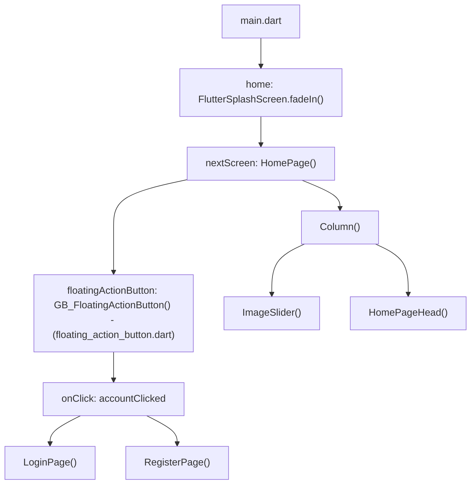

# Grow Buddy

## Flowchart

```mermaid
flowchart TB
A[main.dart]-->B["home: FlutterSplashScreen.fadeIn()"]
B-->C["nextScreen: HomePage()"]
C--->D["floatingActionButton: GB_FloatingActionButton() - (floating_action_button.dart)"]
C-->E["Column()"]-->F["ImageSlider()"]
E-->G["HomePageHead()"]
D-->H["onClick: accountClicked"]
H-->I["LoginPage()"]
H-->J["RegisterPage()"]
```

## Classes

- GB_FloatingActionButton(iconForButton: Icons.arrow_forward_rounded,  onClick: () {})  - To create a floating action button
